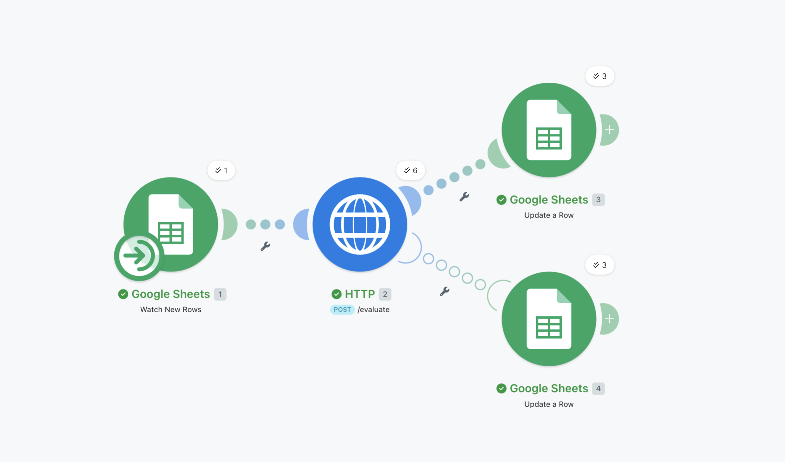
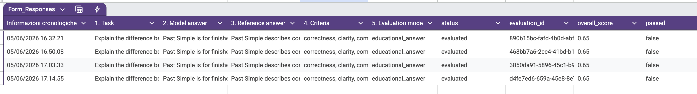
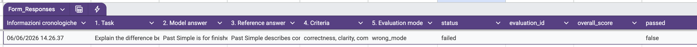
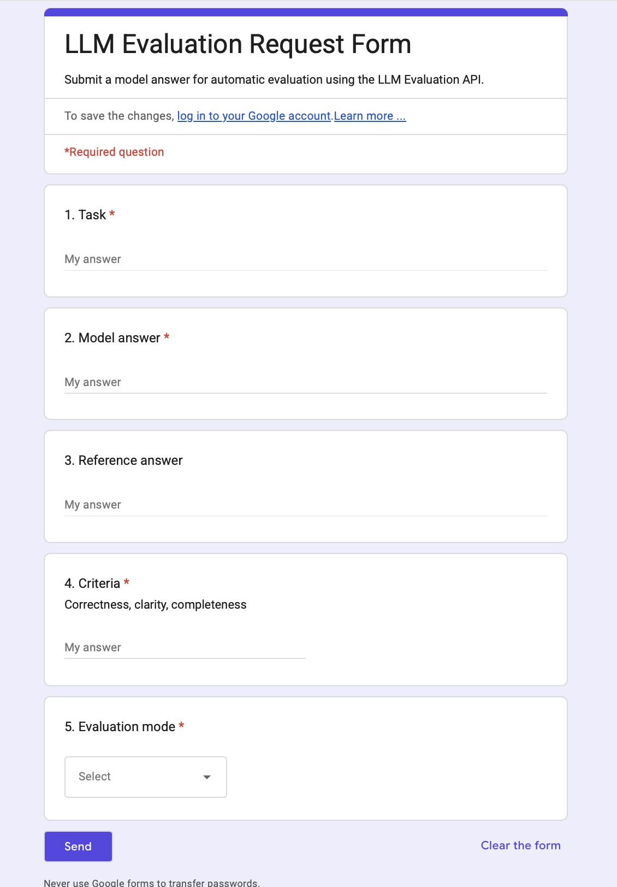

# LLM Evaluation Workflow Automation

This folder documents a low-code workflow automation extension for the **LLM Evaluation API** project.

The workflow connects **Google Forms**, **Google Sheets**, **Make.com**, and a deployed **FastAPI-based LLM Evaluation API**. It allows users to submit model answers through a Google Form, automatically send them to the API for evaluation, and write structured results back to Google Sheets.

## Workflow Overview

```text
Google Form
→ Google Sheets
→ Make.com scenario
→ HTTP POST request
→ Azure FastAPI LLM Evaluation API
→ Structured results written back to Google Sheets
```

The workflow supports both successful API responses and failed API requests through a dedicated error-handling route.

## Tools Used

- Google Forms
- Google Sheets
- Make.com
- HTTP API requests
- FastAPI
- Azure App Service
- LLM Evaluation API

## Input Fields

The Google Form collects the following fields:

- `task`
- `model_answer`
- `reference_answer`
- `criteria`
- `evaluation_mode`

The `evaluation_mode` field uses a dropdown with supported values:

- `general_answer`
- `constraint_following`
- `ambiguity_handling`
- `educational_answer`
- `summarization`

## API Integration

The Make.com HTTP module sends a `POST` request to the deployed FastAPI endpoint:

```text
/evaluate
```

Example request structure:

```json
{
  "task": "Explain the difference between Past Simple and Present Perfect for a B1 learner.",
  "model_answer": "Past Simple is for finished past actions. Present Perfect connects the past with the present.",
  "reference_answer": "Past Simple describes completed past events with a clear time reference. Present Perfect connects past actions or experiences to the present.",
  "criteria": "correctness, clarity, completeness",
  "evaluation_mode": "educational_answer"
}
```

## Output Fields

The structured results are written back to the same row in Google Sheets:

- `status`
- `evaluation_id`
- `overall_score`
- `passed`
- `criterion_scores`
- `error_types`
- `explanation`
- `suggestions`
- `evaluated_at`

## Successful Evaluation Route

For valid submissions, the workflow writes an evaluated result back to Google Sheets.

Example output:

```text
status: evaluated
overall_score: 0.65
passed: false
criterion_scores: 0.65
error_types: missing_information
explanation: The response may need more detail or clarity for the criteria.
suggestions: Add more detail that directly addresses the criteria.
evaluated_at: timestamp
```

## Error Handling Route

The workflow includes an error-handling route for failed API requests.

For example, if an invalid `evaluation_mode` is submitted, the workflow writes:

```text
status: failed
passed: false
error_types: api_error
explanation: API request failed. Check input fields and HTTP error details.
suggestions: Check evaluation_mode and required fields.
evaluated_at: timestamp
```

This makes the workflow more robust because failed requests are logged instead of silently stopping the automation.

## Test Cases

The workflow was tested with several submission types:

1. Good answer  
   - Higher score
   - `passed = true`

2. Weak answer  
   - Medium score
   - `passed = false`
   - `missing_information`

3. Incomplete answer  
   - Lower score
   - `missing_information`
   - `format_error`

4. Invalid evaluation mode  
   - API request failure
   - `status = failed`
   - `api_error`

## Screenshots

### Make.com Scenario



### Evaluated Results in Google Sheets



### Error Handling Output



### Google Form Input



## What This Demonstrates

This workflow demonstrates:

- Low-code workflow automation
- Google Forms and Google Sheets integration
- HTTP API integration
- Connection to a deployed FastAPI backend
- Structured LLM evaluation result logging
- Error handling for failed API requests
- End-to-end AI workflow prototyping
- User-friendly submission design for non-technical users

## Portfolio Summary

Built a low-code automation workflow using Make.com, Google Forms, Google Sheets, and a deployed FastAPI-based LLM Evaluation API. The workflow automatically sends submitted model answers to the API, receives structured evaluation results, and writes scores, pass/fail status, error types, explanations, suggestions, and timestamps back to Google Sheets. I also implemented an error-handling route that logs failed API requests with diagnostic messages.